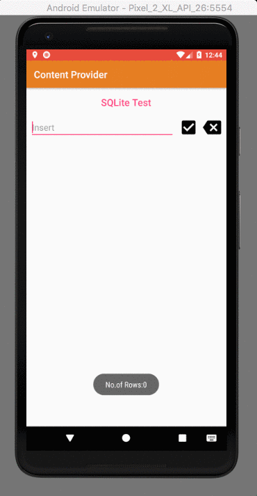

# Advanced_Android_Works

        
Repository that showcases Android simple yet Best Practices with Intermediate to Advanced Project Creation skills

## Contents
**#1 [AndroidAnim](https://github.com/SyamSundarKirubakaran/Advanced_Android_Works/tree/master/AndroidAnim)**
  
**#2 [AndroidDraw](https://github.com/SyamSundarKirubakaran/Advanced_Android_Works/tree/master/AndroidDraw)**  
**#3 [ContentProvider](https://github.com/SyamSundarKirubakaran/Advanced_Android_Works/tree/master/ContentProvider)**
  
**#4 [EspressoExpress](https://github.com/SyamSundarKirubakaran/Advanced_Android_Works/tree/master/ExpressoExpress)**
  
**#5 [FirebaseGoogleSign](https://github.com/SyamSundarKirubakaran/Advanced_Android_Works/tree/master/FirebaseGoogleSign)**
  
**#6 [FlexibleFragments](https://github.com/SyamSundarKirubakaran/Advanced_Android_Works/tree/master/FlexibleFragments)**
  
**#7 [ListWidget](https://github.com/SyamSundarKirubakaran/Advanced_Android_Works/tree/master/ListWidget)**
  
**#8 [MediaPlayback](https://github.com/SyamSundarKirubakaran/Advanced_Android_Works/tree/master/MediaPlayback)**
  
**#8 [WidgetGadget](https://github.com/SyamSundarKirubakaran/Advanced_Android_Works/tree/master/WidgetGadget)**

## 1. AndroidAnim:
An app that illustrates the basics of a single entity transition between two activities. In this case an image is shared between two activities that acts to be transited between the two. 

**You'll Learn:**
* Working with animations on android
* Shared Element transition
* Image cropping 

**Show case:**
 

  

## 2. AndroidDraw:
  
A simple app that demonstates how to draw using android's built in tools and external libraries that helps drawing on screen. 

## 3. ContentProvider:
An app that uses Content provider backed up with SQLite Database to access and edit the data stored in the Database using Content Provider  

**You'll Learn:**
* Working with Content Providers
* SQLite Queries
* Providing Permissions
* ListView
* Content Values 

**Show case:** 

  

## 4. EspressoExpress:
An app that uses Espresso testing mechanism for UI Testing in Android.  

**You'll Learn:**
* Working with Espresso UI testing
* Effective use of [Cheat Sheet](https://google.github.io/android-testing-support-library/downloads/espresso-cheat-sheet-2.1.0.pdf) fot Espresso
* To Maintain UI consistency 

**Show case:** 

  

## 5. FirebaseGoogleSign:
An app that uses Firebase Signin Mechanism backedup with Google APIs to provide your app the access rights to access the basic contents of ypur users priliminary information 

**You'll Learn:**
* Working with [Firebase](https://firebase.google.com/)
* Google APIs for Authentication
* Firebase Authentication
* Obtain UserID to identify an each and every unique user 

**Base Understanding for:**  
* Firebase
* APIs

**Show case:** 

  

## 6. FlexibleFragments:
An app that illustrates the working of Fragments and how they can be altered in realtime when the orientation changes and also to help understand the inter fragment communication. 

**You'll Learn:**
* Fragments
* Handle orientation Changes
* Find of the device in tablet or a mobile device.
* Inter Fragment communication 

**Show case:** 
**Phone:** 

  

 
**Tablet:** 

  

## 7. ListWidget:
An app that illustrates creation of widgets that uses list view and how the widgets list items gets updated in realtimes as the context in the app changes to which the widget points to changes. 

**You'll Learn:**
* Working with widgets
* List View
* Working with remote objects
* Handling and Managing user's preferences to update widget. 

**Show case:** 

  

## 8. MediaPlayback:
An app that uses Exoplayer library to access and stream media from an URL into your app and provides UI to control the streaming of media.  

**You'll Learn:**
* Working with Exoplayer.
* Preserve view location if orientation changes.
* Handle Orientation change.
* Working with Video URL. 

**Show case:** 

  

## 9. WidgetGadget:
An app that illustrates creation of widgets that uses an image and changes the image placed inside the widget based on the user's preference  

**You'll Learn:**
* Working with Widgets.
* Hangle Remote Image Views.
* Handle Wigets size when placed on the home screen. 

**Show case:** 

  

